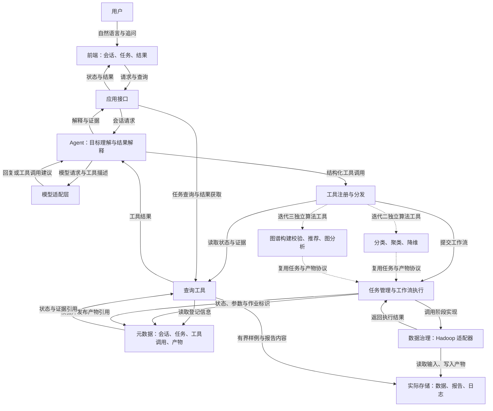

# MovieLens Agent 整体架构与迭代边界

**状态：模型适配、会话与 API、工具、任务、独立 worker、版本化产物、页面和 Hadoop 治理均已实现。** 本文维护三轮共同架构；模块状态以[开发计划](../iterations/01-governance/开发与交接计划.md)为准。Python 和 Hadoop/JDK 组合已通过真实作业验证，实际模型、页面与业务联调见[2026-09-25 报告](../iterations/01-governance/reports/2026-09-25-Agent联调实测.md)，额外真实查询工具已验证。当前追问解析、连续样例及显式重试的实现与验收见[专项计划](../iterations/01-governance/plans/追问解析与重试完善.md)。

来源：[项目总体要求](../course/引言_项目总体要求与汇报安排.md)、[迭代一课程要求](../course/迭代一_Hadoop数据清洗与Agent基础.md)、[需求拆解与验收清单](../iterations/01-governance/需求拆解与验收清单.md)，以及负责人明确的“迭代一为后续轮次搭建 Agent 整体架构”目标。参考资料见第 8 节。

本地开发使用 `duscwalk` 的 Conda 环境 `AgentDev`，Python、Pydantic 和本地包已安装并验证。环境与实际命令统一维护于 [开发环境指南](../development/environment.md)；其余依赖按实现需要安装并记录版本。

实现细节分别维护于 [技术方案与接口约定](../iterations/01-governance/技术方案与接口约定.md)、[数据与评分约定](../iterations/01-governance/数据与评分约定.md)和[开发与交接计划](../iterations/01-governance/开发与交接计划.md)。本文保持三轮共用职责与扩展边界。

## 1. 第一轮的两项交付

1. **可运行的数据治理能力：** Agent 调用 Hadoop 完成三表清洗、前后五维评分、状态展示、报告及追问。
2. **可复用的 Agent 应用框架：** 实现工具注册与调用、工作流与任务管理、会话上下文、数据和结果登记、证据查询、通用前端入口，并提供扩展与运行文档。

第二、三轮通过新增工具实现、工作流、产物类型和必要的专用视图接入。会话管理、工具分发、任务状态、版本追踪和通用展示继续复用；后续模型及图算法按各轮要求分别实现。

第一轮以一个 Agent 组织工具和解释结果即可。建议先采用模块化单应用和单个任务执行工作进程，模块边界保持清楚，具体进程数取决于所选运行环境。

## 2. 逻辑架构

实线表示调用、读写或结果返回，虚线表示后续扩展。图中是逻辑模块，不代表每个模块都需要独立部署。

### 模块职责与本轮完成标准

| 模块 | 责任 | 迭代一应实现的行为 |
| --- | --- | --- |
| 会话与应用接口 | 接收请求、记录消息、绑定任务和结果上下文 | 同一会话能发起任务及追问指定任务；多个任务存在时可明确选择 |
| Agent 与模型适配层 | 理解请求、使用已注册工具、根据证据解释结果 | 模型返回的工具名和参数经过应用校验；模型接入配置与清洗业务逻辑分开 |
| 工具注册与分发 | 描述能力，校验参数、输入版本和前置条件，调用实现 | 可登记计算工具和查询工具；核心分发逻辑不依赖清洗阶段名 |
| 工作流与任务管理 | 执行依赖顺序、记录状态、阶段和外部作业信息 | 数据治理工作流可运行、查询、诊断失败；前端连接断开不直接终止已受理任务 |
| 数据治理工具 | 执行清洗前评分、清洗、清洗后评分 | Hadoop 负责实际计算，返回结构化结果与真实作业记录 |
| 产物登记与查询 | 维护版本、来源、位置、模式和可用性 | 以稳定引用查找原始/清洗数据、指标、隔离记录和报告 |
| 前端与结果展示 | 共享会话、状态、错误和产物入口，按结果类型展示细节 | 通用任务和结果框架，加上五维评分对比视图；后续可增加模型和图结果视图 |

模型只接收工具说明、所需的元数据、指标及有界样例。原始大文件、清洗与训练计算由实际处理工具承担；可获取的结果通过稳定产物引用关联。

## 3. 建议统一的协议

协议的目标是让后续负责人知道“工具接收什么、任务如何查询、结果如何复用”。字段名可在编码前调整，进入使用后通过 `schema_version` 管理结构变更。

### 工具与调用记录

工具定义至少包含 `name`、`tool_version`、说明、输入/输出结构、执行方式（查询或长任务）、所需产物类型、前置校验和对应实现。只有已实现且可用的工具进入可执行清单；用户请求尚未接入的能力时，明确说明当前未提供。

已实现的首轮工具入口：

| 工具 | 输入 | 返回 | 行为 |
| --- | --- | --- | --- |
| `governance.run` | 原始数据引用、规则与评分配置版本、可选参数、请求标识 | 已受理的任务引用，或结构化拒绝原因 | 提交完整治理工作流 |
| `tasks.get` | 任务标识 | 状态、阶段、错误、可用产物引用 | 读取真实任务记录 |
| `artifacts.list` | 任务或数据版本筛选条件 | 有界产物清单 | 查找本次任务或已登记的历史结果 |
| `artifacts.get` | 精确产物引用、所需摘要或样例范围 | 登记信息及有界结果内容 | 为报告展示和追问取证 |
| `datasets.describe` | 数据版本引用 | 真实清单中的表结构、数量、来源与版本信息 | 用于验证新工具的接入路径 |

每次工具调用记录会话标识、调用标识、工具名称、实际输入与输出；长任务另关联任务标识，并保存工作流与实现内容版本。注册表包含工具版本，未来更改工具契约时需同时扩展会话审计的版本记录。查询无需制造一个长任务，但同样保留调用证据。统一返回结构区分 `completed`（即时查询完成）、`accepted`（长任务已受理）、`rejected`（前置校验未通过）和 `failed`（即时工具执行失败），分别承载结果、任务引用或错误；长任务执行失败由任务状态表达。

`governance.run` 在本轮可作为面向 Agent 的完整流程入口，内部阶段由工作流执行器按已登记配置推进。迭代二的每种分类、聚类和降维算法，以及迭代三的每种推荐、图挖掘和链接分析算法，仍须分别注册为可独立调用的工具，遵守课程要求。

### 任务与工作流

| 对象 | 建议必要信息 | 约束 |
| --- | --- | --- |
| 工作流定义 | 名称、版本、输入要求、阶段与依赖、阶段实现、必需产物 | 数据治理顺序明确；后续可新增顺序工作流，本轮无需开发通用图形化编排器 |
| 任务记录 | 任务/会话标识、工作流版本、工具版本、输入产物引用、参数、配置版本、代码版本、状态、阶段、时间、产物引用、错误 | 运行时固定输入版本；重试和历史查询不能隐式切换成最新数据 |
| 阶段记录 | 阶段名、执行次数、外部作业标识、开始结束时间、状态、日志与产物位置 | 能从页面中的失败定位到实际计算阶段 |

正常任务状态为 `queued → running → succeeded/failed`，当前阶段单独记录。中断后无法核实外部执行状态时使用 `unknown`（状态待核查），首版保持该状态供人工核查，尚无接续或重新发布接口；不得直接重新排队。完整迁移、受理去重和发布规则见技术方案。

对同一前端请求标识重复提交，返回同一个已受理任务；用户明确重新运行则生成新请求与任务标识。不得仅凭自然语言相似就合并用户主动发起的不同任务。

### 产物与版本

统一产物引用使用 `artifact_id + version`，与机器路径分离。登记信息至少包含：

- `kind`、`schema_version`、数据或模型本身的版本及存储位置。
- 生成任务、使用的工具/配置版本、上游产物引用与内容校验信息。
- 发布状态、校验记录、可展示的摘要及已知限制。
- 适用时的数据范围、`train_end`、`validation_end`、训练截止时间及所属数据版本。

第一轮实际登记数据集、质量指标、处置记录和报告；数据集清单包含三张表各自的模式、编码、文件位置与数量。模型、用户画像、嵌入坐标、知识图谱和推荐结果在后续轮次增加类型与专用校验，沿用公共字段。

输入能否用于某工具，由该工具的前置规则决定：治理工具允许处理带异常的原始数据；图分析工具则必须要求指定图谱已完成校验且版本一致。不能把“任务成功”或“产物已发布”直接解释为数据质量满分。

## 4. 本轮执行与可信结果

数据治理工作流建议包含：输入与版本确认 → Hadoop 清洗前评分 → Hadoop 清洗 → Hadoop 清洗后评分 → 结果核对、时间边界登记与报告生成 → 发布产物。

工作流执行器保证已登记的阶段顺序，模型负责选择工具、组织调用和解释，避免把必须执行的流程只写在提示词里。Hadoop 的输出、指标、处置数量和错误是报告与回答的依据。

发布采取“写入本次任务专属位置、核对必需产物、登记为可用”的顺序。临时或失败产物不进入正常可复用清单，历史正式产物保留原引用。任务受理和请求去重需要持久化记录；首版建议以 SQLite 事务管理受理和发布，采用文件先就绪、登记后可见的顺序；中断核查规则见技术方案。文件 rename 的原子性不能直接推广到所有存储产品。

会话保留显式的任务与产物引用，追问优先查询关联结果；用户指定历史任务时切换到对应证据。如果存在多个候选任务且指向不明确，应先澄清，不能静默取“最新结果”。评分、版本和执行状态等事实字段由工具结果提供，Agent 生成说明并标注证据来源。

训练数据的防泄漏与第三轮图谱校验由工具前置条件和登记信息落实。通用框架承载验证接口，各轮业务工具实现具体检查；本轮先实现数据引用、版本一致性及时间边界的校验路径。

## 5. 三轮如何衔接

| 层面 | 迭代一实际交付 | 迭代二新增 | 迭代三新增 |
| --- | --- | --- | --- |
| 工具能力 | 数据治理、任务与证据查询、数据清单查询 | 每种分类/聚类/降维算法的独立工具 | 图谱构建与校验，以及每种推荐/图挖掘/链接分析算法的独立工具 |
| 共用执行机制 | 工具注册、参数校验、任务和工作流、失败记录 | 接入训练与分析工作流 | 接入图谱与图任务工作流及前置校验 |
| 产物登记 | 原始/清洗数据、处置记录、质量指标、报告、时间边界 | 模型、画像、用户群体、降维坐标、参数与指标 | 图谱、图投影、推荐、社区和排序结果及版本关系 |
| 用户交互 | 会话、任务状态、样例/报告入口、五维结果视图 | 新增模型评价、聚类与降维视图 | 新增图谱与图分析视图 |
| 交接材料 | 工具开发约定、数据模式、运行方法、真实任务样例、已知限制 | 补充模型和分析产物协议 | 补充图谱模式、校验方法与上层工具协议 |

## 6. 架构验收

下面是小组根据可扩展目标新增的验收场景。自动化边界验证和真实联调已记录；新增的 datasets.versions 已通过真实模型和通用页面验证（见 scripts/examples/catalog_versions.py）；下一位成员的复现尚未完成。

1. **工具扩展：** 在框架完成后接入 `datasets.describe`，实际读取已登记数据清单；只需增加工具实现、注册信息与必要验证，复用同一调用记录和通用结果展示，分发器不增加清洗专用分支。 若该工具已作为首个开发样例接入，验收时另选读取真实登记信息的查询工具验证扩展过程。
2. **计算与查询共存：** Hadoop 治理任务运行期间可以读取真实状态；即时查询与长任务的返回语义明确。
3. **上下文隔离：** 同一会话先后执行两个任务，分别追问指定任务时返回对应版本的证据；其他会话不会继承其任务指向。
4. **版本与失败：** 输入引用不兼容或不存在时明确拒绝；阶段失败时保留信息，部分结果不会被误认为完整产物；重复传输同一请求不重复受理。
5. **重启可核查：** 完成任务的状态与报告可重新读取，未完成任务依真实作业信息处理，不长期显示无依据的“运行中”。
6. **交接：** 下一轮负责人按文档启动应用、复现真实治理任务并说明如何新增算法工具，能够读取版本化清洗数据与时间边界。

扩展验证使用真实查询能力。后续算法未实现时清楚标注当前不可用；测试样例和测试替身与正式演示数据分开。

## 7. 对开发顺序的影响

Agent 公共接口应从开发初期进入设计。数据核查与框架设计可以交错推进：核查约束指标与规则，框架设计确定工具、任务、产物和会话之间的关系。

先确定公共协议并通过真实数据清单查询打通注册、分发、证据返回与前端展示，再接入运行时间更长的 Hadoop 治理工作流。这样可尽早验证模型接入、工具调用和上下文处理，而数据治理规则仍可按核查结果完善。

本轮完成上述共用能力及数据治理；后续有明确需要时再引入更复杂的任务调度、分布式服务或多 Agent 协作。技术选型中记录每项决定的需求、依据、代价和替换条件，供 hw2/hw3 使用。

## 8. 课件与阅读材料参考

已查阅以下材料的相关页面。材料保存在本地 `slides/`，不随 Git 同步；页码为 PDF 文件页序。这些内容提供设计依据，具体 Agent 协议是本项目的设计建议。

| 材料与位置 | 相关内容 | 对本项目的启发 |
| --- | --- | --- |
| `Slides-20260924/26Fall-001-大数据分析-导论0826.pdf`，第 20—21、26 页 | Usage、Quality、Context、Scalability；数据、算法模型与工具平台；分类到知识图谱的课程主题 | 围绕整个分析应用设计公共接口，数据治理与后续算法共享入口和产物管理 |
| `Pre-class reading-20260924/Class2 DQ+ETL/The History, Present, and Future of ETL Technology.pdf`，第 3 页 | 可扩展 ETL 活动、可复用元数据与流程、监控测试和生命周期演进 | 将业务阶段与工作流执行分开，保留状态与证据，为后续阶段扩展提供统一机制 |
| `Pre-class reading-20260924/Class2 DQ+ETL/The_Challenges_of_Data_Quality_and_Data_Assessment_in_the_Big_Data_Era.pdf`，第 7 页 | 按业务目标确定质量评价要求，建立反馈过程；准确性判断需要证据 | 评分方法按数据与用途确定；每次运行固定方法与参照，解释可验证范围 |
| `Pre-class reading-20260924/Class4 Google 3 papers+/The Google File System.pdf`，第 3 页 | 元数据位置查询与实际数据读写的职责分离 | 任务与产物登记保存引用和状态，大数据由处理工具直接读取，Agent 获取摘要与证据 |
| `Pre-class reading-20260924/Class4 Google 3 papers+/MapReduce- Simplified Data Processing on Large Clusters.pdf`，第 4—5 页 | 任务状态、失败重执行、临时输出与原子提交 | 区分受理、计算完成和结果发布，记录真实作业状态并考虑重复执行；发布语义依赖实际存储 |
| `Pre-class reading-20260924/Class4 Google 3 papers+/Bigtable- A Distributed Storage System for Structured Data.pdf`，第 1—2 页 | 根据使用场景设计数据模型、行/列访问与多版本 | 明确结果的读取模式和版本含义；业务版本仍需显式管理，是否引入宽列存储另行论证 |

导论第 25 页中的考核安排与当前项目文档不一致。实施范围和交付日期采用当前项目文档及小组确认的安排：三轮项目迭代，第一轮 9 月 30 日；参考材料不改变这些要求。
