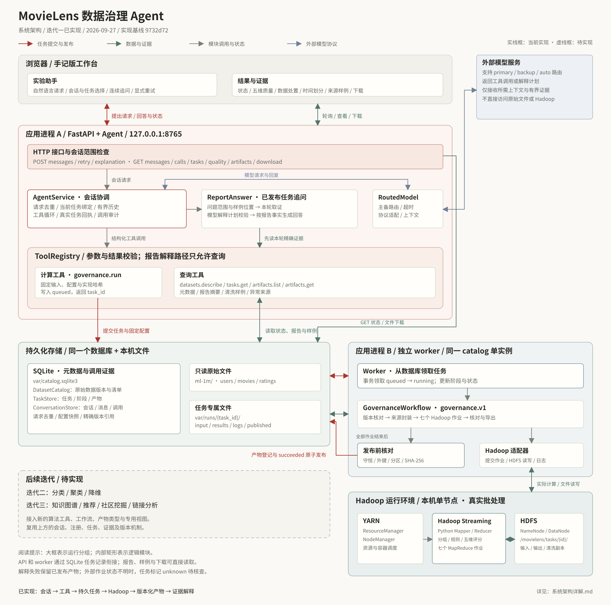
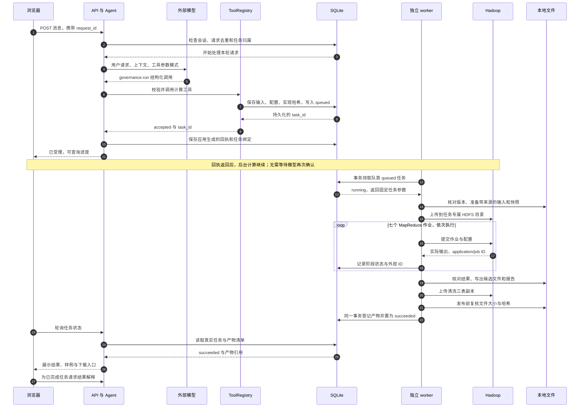
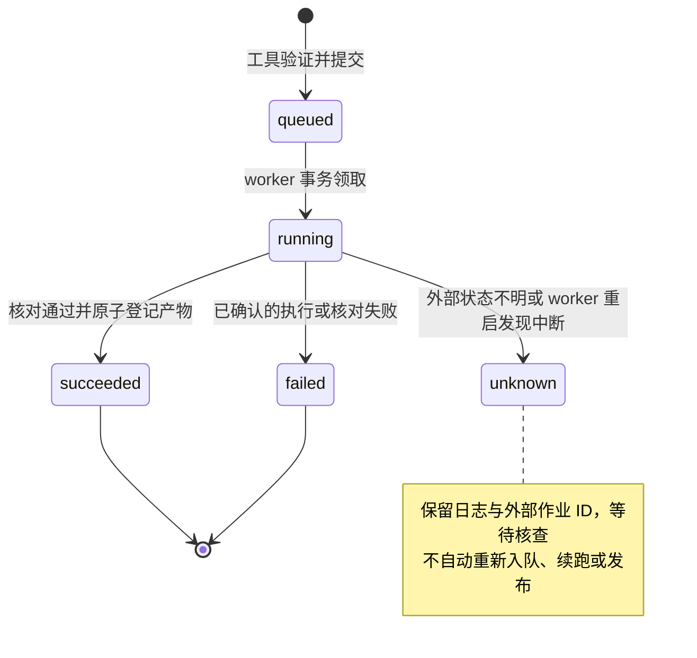
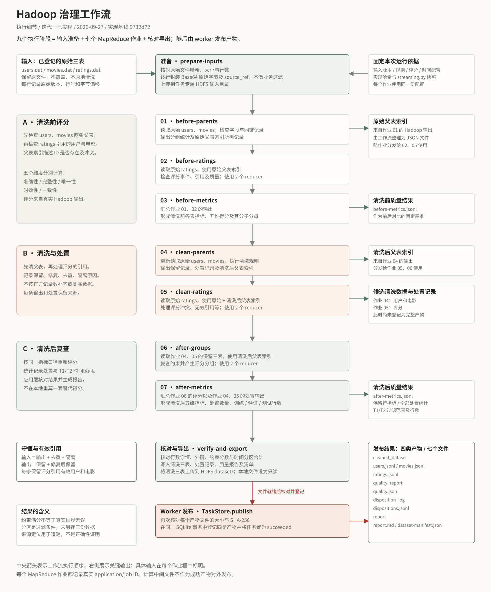
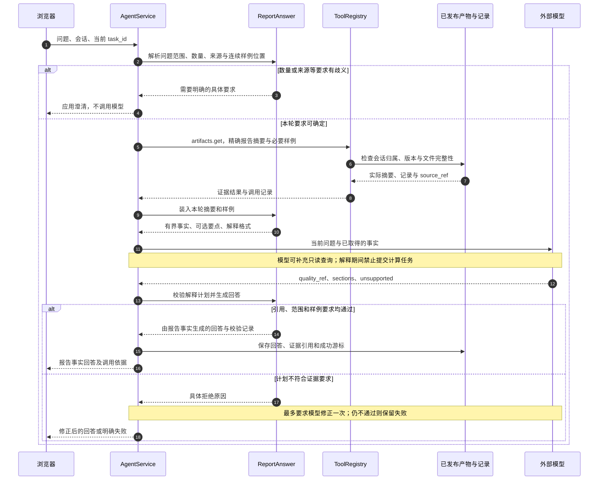

# MovieLens Agent 系统架构详解

本文面向第一次接触项目的读者，说明迭代一已经实现的系统如何工作。核对日期为 **2026-09-27**，应用代码基线为 **`9732d72`**；本次补充架构说明与图件，不改变应用行为。三轮的设计目标另见[整体架构与迭代边界](Agent整体架构与迭代边界.md)。

先记住三个职责：**Agent 把用户请求组织成工具调用；Hadoop 执行数据清洗和评分；应用保存并核对结果，再把结果展示、解释给用户。** 模型参与理解和选择解释要点，真实数据、任务状态与质量数字都来自工具和已发布文件。

## 1. 系统总览

[放大查看 SVG](diagrams/system-architecture.svg) · [下载 PNG](diagrams/system-architecture.png) · [下载 PDF](diagrams/system-architecture.pdf)

按“浏览器 → 应用 → 持久化任务 → worker → Hadoop → 发布产物 → 查询与解释”的顺序读图。红线表示任务提交与发布，绿线表示数据和证据，灰线表示模块调用和状态，蓝灰线表示模型协议；虚线框中的第二、三轮能力尚未实现。连线给出主要关系，具体调用先后见后面的时序图。

### 1.1 大框对应什么

| 运行部分 | 实际形态 | 职责 |
| --- | --- | --- |
| 浏览器 | 原生 HTML、CSS、JavaScript，当前采用手记版布局 | 发消息、选择任务、轮询进度、查看质量与样例、下载文件 |
| 应用进程 A | 一个 FastAPI 进程；Agent、模型适配、工具注册等是进程内模块 | 接收 HTTP 请求、协调模型与工具、管理会话、返回查询结果 |
| 应用进程 B | 独立的单个 worker 进程 | 从 SQLite 领取任务，调用已注册工作流，核对并发布结果 |
| Hadoop | 本机单节点 HDFS、YARN 和 Hadoop Streaming | 存储计算输入输出，调度和运行真正的 MapReduce 作业 |
| 外部模型服务 | 通过 HTTP 访问配置的模型服务 | 根据上下文提出工具调用，或返回受约束的报告解释计划 |
| 持久化存储 | 同一个 SQLite 数据库、本地文件和 HDFS 目录 | 分别保存运行元数据、会话证据与数据文件 |

API 与 worker 通过 **SQLite 中的任务记录**衔接。AgentService、ToolRegistry、ReportAnswer 这些名字表示 Python 模块职责，不表示额外部署的服务。Hadoop 的四个常驻进程是 NameNode、DataNode、ResourceManager、NodeManager。

### 1.2 几个容易混淆的词

| 名称 | 在本项目中的含义 | 例子 |
| --- | --- | --- |
| 模型 | 接收上下文并输出文本或结构化调用的外部服务 | 提出调用 `governance.run` |
| Agent | 围绕模型构建的应用协调逻辑，包含上下文、工具、证据与执行限制 | 获取工具结果后返回真实任务回执 |
| 工具 | 有明确名称、参数模式和返回语义的能力入口 | `artifacts.get` 读取某个精确版本的产物 |
| 工作流 | 已写好的、多阶段业务执行过程 | `governance.v1` 的准备、七作业和导出 |
| 任务 | 某次工作流运行的持久记录，有自己的 ID、配置、状态与日志 | 对同一数据独立提交两次清洗，会产生两个任务 |
| 产物 | 任务成功发布后可查询的、有版本的结果集合 | 清洗数据集、质量报告、处置记录 |
| 证据 | 支撑一段回答或统计的具体数据及其来源引用 | 某份报告的时效性分子、分母和一条原始行 |

## 2. 应用内部各模块做什么

| 模块 | 输入与工作 | 输出或边界 |
| --- | --- | --- |
| HTTP API | 接收消息、查询、下载请求，检查会话内的任务与产物范围 | 返回真实记录或文件；静态页面也由它提供 |
| ConversationStore | 记录会话、用户请求、消息、模型调用和工具调用 | 支持请求去重、处理中消息互斥、当前任务和历史证据定位 |
| AgentService | 组织有限历史、模型上下文和工具循环，协调本轮取证 | 返回回答、任务回执、澄清或结构化失败；模型轮数和工具调用数有上限 |
| RoutedModel | 按设置使用 `primary`、`backup` 或 `auto`，适配模型协议与超时 | 返回模型响应或明确错误；图中路由能力不代表服务实时健康状态 |
| ToolRegistry | 注册工具，使用 Pydantic 校验参数与结果，区分查询和计算 | 查询立即返回结果；计算受理后返回 `task_id`；拒绝与执行失败分开记录 |
| ReportAnswer | 解释治理追问的范围，组织报告事实，校验模型的解释计划 | 使用已读证据生成回答；报告解释路径只允许查询工具 |
| DatasetCatalog / TaskStore | 保存原始数据版本、任务阶段、配置快照和产物清单 | 提供精确版本引用、任务领取与发布事务 |
| Worker / GovernanceWorkflow | 领取任务、核对版本、执行阶段、检查结果 | 成功产物清单或失败/状态不明记录 |
| Hadoop 适配器 | 上传下载 HDFS 文件，启动 Streaming 作业，收集 ID 和日志 | 返回真实作业输出，保留外部状态核查依据 |

当前主要工具如下。计算工具只负责验证并提交任务，耗时计算由 worker 完成。

| 工具 | 类型 | 用途 |
| --- | --- | --- |
| `datasets.describe` | 查询 | 读取已登记原始数据版本的清单 |
| `governance.run` | 计算 | 固定输入、配置和实现哈希，提交 `governance.v1` |
| `tasks.get` | 查询 | 查看任务真实状态、阶段及已发布产物 |
| `artifacts.list` | 查询 | 列出任务的已发布产物 |
| `artifacts.get` | 查询 | 按精确引用读取元数据、摘要、清洗样例或异常来源 |

## 3. 一次清洗请求如何运行

用户可以输入“使用默认规则清洗数据并比较前后质量”。API 接收的是一次会话消息，模型提出工具调用，工具验证通过后才会形成真实任务。**页面显示“已受理”时，数据计算可能还没有开始。**

图中工具和 Agent 都在 API 进程内；SQLite 是共享存储。时序图省略了每轮调用审计的重复写入，以及执行期间反复发生的页面轮询。

### 3.1 请求去重与任务状态

同一会话重复传输相同 `request_id` 和内容时，复用原请求；同一个 ID 配不同内容会发生冲突。工具调用也根据本次请求与规范化参数生成稳定标识。用户主动再次发送一条新清洗消息属于新请求，可能创建新任务，系统不会仅凭两句话相似就合并它们。

任务成功和消息回答成功是两个不同维度。Hadoop 已成功的任务，不会因为后面的模型解释失败而退回失败。API 重启会恢复处理中消息的中断记录；worker 重启则把原来 `running` 的任务及阶段标为 `unknown`，因为外部 Hadoop 作业可能仍在执行。

“原子发布”指**产物登记和任务成功状态在同一个 SQLite 事务中生效**。文件会先写出并核对；即使失败后磁盘上留下部分文件，查询接口也不会把它们当成已发布的完整结果。这里没有跨 SQLite、文件系统和 HDFS 的分布式事务。

## 4. Hadoop 内部为什么需要七个作业

[放大查看流程 SVG](diagrams/governance-pipeline.svg) · [下载 PNG](diagrams/governance-pipeline.png) · [下载 PDF](diagrams/governance-pipeline.pdf)

`users` 和 `movies` 是父表，`ratings` 通过用户 ID 和电影 ID 引用它们。因此要先知道哪些用户和电影存在、是否冲突，再判断评分记录的引用是否成立；清洗之后还要按同一评价方法重新检查。

| 顺序 | 作业 | 主要输入 | 负责的结果 |
| --- | --- | --- | --- |
| 1 | `before-parents` | 原始用户、电影 | 父表质量统计、原始父表索引所需记录 |
| 2 | `before-ratings` | 原始评分、原始父表索引 | 清洗前评分质量与引用检查 |
| 3 | `before-metrics` | 作业 1、2 的输出 | 清洗前各表指标与五维得分 |
| 4 | `clean-parents` | 原始用户、电影 | 清洗后父表、处置记录、清洗后父表索引所需记录 |
| 5 | `clean-ratings` | 原始评分、原始及清洗后父表索引 | 清洗后评分、去重和隔离等处置记录 |
| 6 | `after-groups` | 作业 4、5 的保留记录、清洗后父表索引 | 对保留三表再次分组和检查 |
| 7 | `after-metrics` | 作业 6 的评分与作业 4、5 的处置输出 | 清洗后质量、处置统计、时间划分统计 |

每个作业都使用 Hadoop Streaming 调用 Python Mapper/Reducer。Mapper 将记录转换为可分组的键值，Hadoop 负责分组和传输，Reducer 处理同组记录或汇总统计。作业 2、5、6 使用两个 reducer，其余使用一个。父表索引由工作流从 Hadoop 输出整理成小型 JSON 文件，再随需要它的作业分发。

七个作业之外还有 `prepare-inputs` 和 `verify-and-export` 两个阶段，所以页面会展示 **九个执行阶段**。准备阶段保留原始字节和来源、进行编码封装，不承担清洗规则；核对导出阶段检查 Hadoop 的结果并生成文件，不另行计算一套本地评分来替代 Hadoop。

当前评分是五个维度，未计算总分。准确性、完整性、唯一性和一致性的满分表示保留记录通过当前已实现约束；它们不能证明真实世界信息正确。时效性使用固定历史参照和窗口，清洗后仍可很低。规则、分母、三表聚合和局限见[数据与评分约定](../iterations/01-governance/数据与评分约定.md)。

## 5. 报告追问如何有据可查

已完成任务的追问采用 `quality-facts-v3` 策略。比如“只解释时效性”或“再给一个刚才规则的异常样例”，应用会先确定本轮需要什么，再读取当前任务的精确报告与样例。模型收到的是有界事实和可用要点，不是整份百万行数据。

### 5.1 谁决定什么

应用负责取得正确任务的报告，明确问题的范围、样例数量和来源；模型选择要解释的事实段落，并标记无法支持的要求；渲染器核对版本、要点、样例位置和限制后，用真实证据生成文字。模型不能在这一流程中自行改写统计数字或用旧对话替代本轮报告。

这也解释了页面上几类消息的区别：任务受理是应用回执，歧义问题得到应用澄清，成功的报告解释标为报告事实回答。普通模型对话与这些受校验的消息保留不同来源标记。

### 5.2 连续样例和显式重试

“再给一个”会沿用同一任务、报告、规则和样例位置；只有成功返回后才推进游标。缺少明确前文或切换了上下文时，应用可能要求澄清。

对可重试的失败解释，重试会读取**原问题、原任务、冻结的解释要求及预期报告引用**，创建新的请求 ID，并保留原失败记录。它不会拿后来选中的其他任务替换原任务，也不会通过重试按钮重新运行清洗。

任务完成后的自动解释使用稳定的 `explain:{task_id}` 请求标识；重复触发会读取已有结果。历史缓存不会因代码升级而自动重算。新的追问与失败回答的显式重试分别有独立入口。

## 6. 数据、版本与证据存在哪里

### 6.1 三种存储的分工

| 位置 | 保存内容 | 用途 |
| --- | --- | --- |
| `var/catalog.sqlite3` | 原始数据清单、任务与阶段、产物清单、会话与调用记录 | 可按 ID 和版本查找、做事务与去重；大量数据行放在文件中 |
| `ml-1m/` | 登记时读取的原始三表 | 只读来源，任务执行时重新验证其内容 |
| `var/runs/{task_id}/input/` | 带原始字节与来源的封装输入 | 将登记文件送入 Hadoop |
| `var/runs/{task_id}/results/` | 各 Hadoop 阶段取回的结果 | 检查、导出与问题定位 |
| `var/runs/{task_id}/logs/` | 阶段日志 | 结合外部作业 ID 核查运行 |
| `var/runs/{task_id}/published/` | 候选及最终发布的结果文件 | 是否可对外读取由数据库登记状态决定 |
| HDFS `/movielens/tasks/{task_id}/` | 输入、各作业输出及 `dataset/` 清洗三表副本 | Hadoop 实际计算与数据存储；此前缀可配置 |

三个存储类共享同一个 SQLite 文件：`DatasetCatalog` 管原始版本；`TaskStore` 管 `tasks / attempts / artifacts`；`ConversationStore` 管 `chat_sessions / chat_requests / chat_messages / chat_tool_calls / chat_model_calls`。它们是逻辑分工。

### 6.2 一次成功任务发布什么

| 产物类型 | 文件 | 主要用途 |
| --- | --- | --- |
| `cleaned_dataset` | `users.jsonl`、`movies.jsonl`、`ratings.jsonl` | 下一轮分析的固定输入，保留行级来源 |
| `quality_report` | `quality.json` | 前后评分、处置、时间配置、运行信息和局限的机器可读证据 |
| `disposition_log` | `dispositions.jsonl` | 全部记录的处置与原因追踪 |
| `report` | `report.md`、`dataset-manifest.json` | 供人阅读的报告和清洗数据清单 |

合计是 **四类产物、七个文件**。训练、验证、测试目前由 `T1/T2` 过滤条件和行数表示，没有另行生成三份分区文件；后续读取方式见[清洗数据读取](../iterations/01-governance/handoff/清洗数据读取.md)。

### 6.3 如何避免拿错版本

任务固定原始 `dataset_ref`、规则/评分/时间配置引用及 Python 实现哈希；运行前若来源或实现已改变，会拒绝继续使用旧提交。每类产物使用 `{artifact_id, version}` 引用，文件位置与版本引用分开保存，清单记录文件大小与 SHA-256。

单条记录的 `source_ref` 包含原始数据版本、文件名、行号和字节偏移。它回答“这条数据从哪里来”；哈希回答“内容是否与登记时一致”。两者都不能独自证明真实世界属性正确。

## 7. 哪些操作需要模型，哪些直接读取

所有业务接口位于 `/api/v1`；会话接口再以 `/sessions/{session_id}` 为范围。完整接口约定见[Agent、模型与页面指南](../development/app-and-model.md)。

| 用户操作 | 主要路径 | 依赖模型 |
| --- | --- | --- |
| 自然语言发起清洗 | 消息 → Agent → 模型工具调用 → `governance.run` | 是；任务受理后的 Hadoop 执行独立继续 |
| 查看任务阶段 | `GET tasks/{task_id}` → TaskStore | 否 |
| 查看五维、处置、时间划分 | `GET tasks/{task_id}/quality` → 已发布质量摘要 | 否 |
| 查看清洗或异常样例 | 产物版本接口 → `artifacts.get` | 否 |
| 下载文件 | 产物下载接口 → 清单、文件大小/哈希检查 → 文件响应 | 否 |
| 围绕结果追问 | 消息或解释接口 → 本轮取证 → 模型计划 → 校验渲染 | 是；要求有歧义时应用可先直接澄清 |
| 显式重试失败解释 | 原消息的 `retry` 接口 → 恢复原要求 → 再取证和解释 | 是；不会重跑 Hadoop |
| 查看消息调用依据 | 原消息的 `calls` 接口 → 持久调用记录 | 否 |

因此，模型服务超时会影响新消息或解释，但不会阻止读取已经发布的状态、报告和文件。页面轮询运行中任务，不需要让模型反复问“完成了吗”。

## 8. 当前部署、故障边界与扩展方向

当前环境是 WSL 中的 `AgentDev` Python 环境，应用使用 FastAPI/Uvicorn，Hadoop 3.5.0 配合 JDK 17 在本机单节点运行。API 默认访问地址为 `127.0.0.1:8765`。同一 catalog 用文件锁限制为一个 API 和一个 worker；当前面向可信本机使用，尚未建设多用户身份认证或多机高可用部署。启动方式见[演示说明](../iterations/01-governance/demo/演示说明.md)和[Hadoop 指南](../development/hadoop-local.md)。

| 情况 | 当前行为 |
| --- | --- |
| 参数、数据版本或产物引用不合法 | 工具拒绝，返回可定位的错误 |
| Hadoop 作业或结果核对确认失败 | 任务记为 `failed`，留下阶段与日志，不发布完整产物 |
| worker 中断或外部状态不能确认 | 任务记为 `unknown`，保留外部 ID 待核查，不隐式重跑 |
| 模型服务失败或解释计划不合格 | 记录该次消息失败；已成功任务与产物仍可查 |
| 文件在发布后丢失或被修改 | 相关读取的完整性检查失败，拒绝将其作为原版本证据 |

第二、三轮接入时，通用框架已经提供会话、工具注册、参数校验、任务执行、日志与产物引用。需要新增的业务能力如下：

| 迭代 | 待实现能力 | 接入位置 |
| --- | --- | --- |
| 二 | 评分分类、用户偏好聚类、降维；每类选两种课程算法 | 独立算法工具、训练/分析工作流、模型及评价产物、相应证据策略与视图 |
| 三 | 用户—电影—类型知识图谱及校验，图上的推荐、社区挖掘、链接分析 | 图谱及图投影产物、图工作流、独立算法工具；后续三个分析类别各两种课程算法 |

每个新计算工具验证并提交任务，worker 的工作流映射接入实际算法，结果按新产物协议发布。**治理专用的报告解释策略与质量页面也需要相应扩展**，不能只替换工具名称就自动得到分类或图分析界面。图谱相关分析还要检查图谱已完成、校验通过且版本一致。三轮边界和课程要求见[整体架构](Agent整体架构与迭代边界.md)。

## 9. 从图定位到代码

以下链接均指向仓库源码，适合从具体模块继续阅读。

| 图中部分 | 代码入口 |
| --- | --- |
| 手记版页面与轮询 | [web/index.html](../../src/movielens_agent/web/index.html)、[web/app.js](../../src/movielens_agent/web/app.js)、[web/app.css](../../src/movielens_agent/web/app.css) |
| HTTP API | [api/app.py](../../src/movielens_agent/api/app.py) |
| Agent 与外部模型 | [agent/service.py](../../src/movielens_agent/agent/service.py)、[agent/model.py](../../src/movielens_agent/agent/model.py)、[agent/settings.py](../../src/movielens_agent/agent/settings.py) |
| 问题解析与证据回答 | [governance/questions.py](../../src/movielens_agent/governance/questions.py)、[agent/explanation.py](../../src/movielens_agent/agent/explanation.py)、[governance/explanation.py](../../src/movielens_agent/governance/explanation.py) |
| 工具和公共数据协议 | [tools/registry.py](../../src/movielens_agent/tools/registry.py)、[tools/governance.py](../../src/movielens_agent/tools/governance.py)、[tools/datasets.py](../../src/movielens_agent/tools/datasets.py)、[contracts.py](../../src/movielens_agent/contracts.py) |
| 数据、任务与会话存储 | [storage/catalog.py](../../src/movielens_agent/storage/catalog.py)、[storage/tasks.py](../../src/movielens_agent/storage/tasks.py)、[storage/conversations.py](../../src/movielens_agent/storage/conversations.py) |
| 独立执行进程 | [jobs/worker.py](../../src/movielens_agent/jobs/worker.py)、[cli.py](../../src/movielens_agent/cli.py) |
| 七作业及 Hadoop 适配 | [workflows/governance.py](../../src/movielens_agent/workflows/governance.py)、[adapters/hadoop.py](../../src/movielens_agent/adapters/hadoop.py)、[governance/streaming.py](../../src/movielens_agent/governance/streaming.py) |
| 规则、质量、时间配置 | [configs/governance/default.json](../../configs/governance/default.json)、[governance/config.py](../../src/movielens_agent/governance/config.py) |

图件来源与导出命令见[图件说明](diagrams/README.md)。图中省略了底层库和每条审计写入，以运行边界、主要调用及数据依赖为阅读重点；实现改变时应同步修改文字、图源和导出文件。
