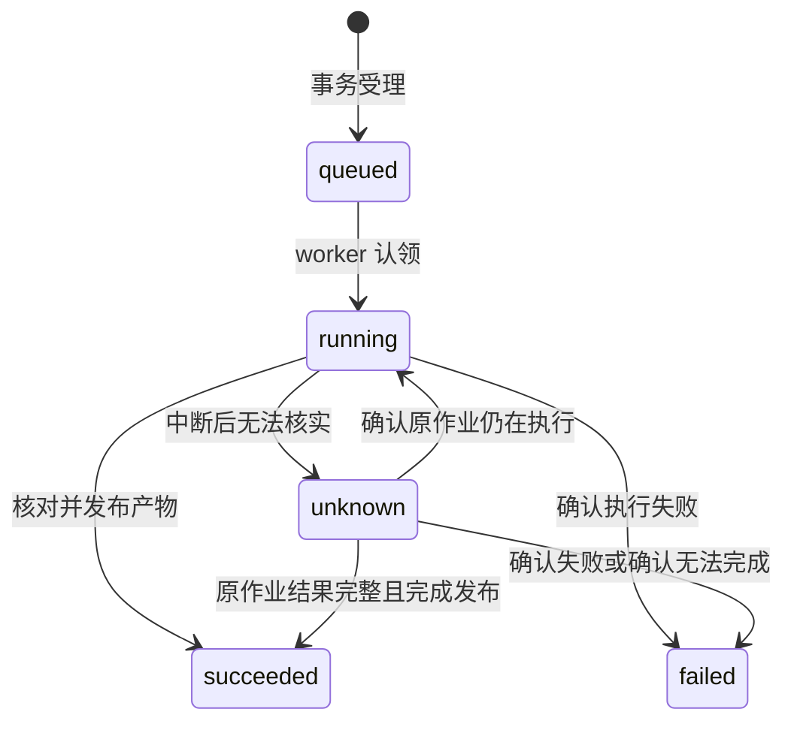

# 迭代一：技术方案与接口约定

**状态：规则、Hadoop 治理、工具、SQLite 任务、独立 worker 与产物发布已实现；模型、会话 API 和前端仍待实现。** 本文将 [整体架构](../../architecture/Agent整体架构与迭代边界.md) 落实为可编码的模块和接口。负责人已确定使用 `AgentDev`；其余选型作为开发基线，安装时核查兼容性并记录版本，实际不适用时更新本文件与变更理由。

数据格式和评分口径见 [数据与评分约定](数据与评分约定.md)，实施顺序见 [开发与交接计划](开发与交接计划.md)。课程需求与小组架构目标仍以 [需求清单](需求拆解与验收清单.md) 为依据。

## 1. 已知条件与首版选型

2026-09-24 的只读环境检查：WSL2，12 个逻辑处理器，系统可见内存约 7.6 GiB；`AgentDev` 初始为空，现已安装并验证 Python 3.11.16、Pydantic 2.13.5 与项目包；系统 Java 为 OpenJDK 17.0.20.1。初始 PATH 未找到 Hadoop；现已在用户目录安装 Hadoop 3.5.0，使用现有 JDK 17 验证 HDFS/YARN 与 AgentDev Streaming。命令通过 runtime.json 指定绝对路径。

| 决策 | 候选方案 | 首版建议与理由 | 后续调整条件 |
| --- | --- | --- | --- |
| 本地 Python 环境 | 已有 `AgentDev`、新建环境 | 使用负责人指定的 `AgentDev`；建议安装 Python 3.11，便于统一工具与数据处理代码 | 库或运行环境有明确不兼容时再调整并重验 |
| 应用接口 | FastAPI、Flask、由页面框架直接执行业务 | FastAPI + Pydantic，明确请求、工具参数和结果结构，后续可直接扩展 API | 实际依赖兼容性与开发复杂度验证后调整 |
| Agent 编排 | 受控工具调用循环、LangGraph 等编排框架 | 首版采用小型工具调用循环与模型适配接口；固定业务流程由工作流执行器管理 | 多分支状态、人工介入或复杂恢复有明确需求时再评估框架 |
| 任务执行 | 独立本地 worker、API 进程内任务、Celery 等队列 | 一个独立 worker + SQLite 持久任务表；页面请求结束不影响已受理任务 | 多机器、多 worker 或明显并发需求出现时更换队列实现 |
| 元数据 | SQLite、JSON 文件、PostgreSQL | SQLite，便于原子受理、唯一约束、关联查询与交接；按短事务访问 | 锁竞争或跨机器访问成为实际问题时迁移 |
| 前端 | 普通 HTML/JavaScript、Streamlit、完整 SPA | FastAPI 提供静态页面和 API，普通 HTML/JavaScript 完成会话、状态与结果；减少首版构建环节 | 交互复杂度增加时引入更完整前端框架，保留 API |
| Hadoop | 本机伪分布式、容器部署、远程集群 | 优先验证本机单节点 HDFS/YARN + Hadoop Streaming；Python mapper/reducer 在 `AgentDev` 执行 | 与 JDK、资源或部署条件不兼容时比较容器/其他部署，记录选择依据 |
| 数据与报告 | 行式文本、Parquet、数据库表 | Hadoop 中间数据及清洗表采用 UTF-8 JSONL；指标和清单用 JSON，报告用 Markdown；大文件放 HDFS，元数据和小报告保存在本地 | 后续训练扫描量或格式要求增加时增加 Parquet 等输出适配 |
| 模型接入 | 可用托管模型、本地模型 | 用可替换模型适配器接入；具体服务、模型名和调用配置待确定 | 按工具调用能力、响应时间、成本与实际可用性选择 |

Hadoop/JDK 的具体版本组合须依据所选发行版说明和小作业实测确定，不能仅凭系统有 Java 17 就视为兼容。资源配置需要为应用、模型调用和操作系统留出空间，记录实际运行峰值；首版不预设需要单独的 HBase、Hive 或全文检索服务。

以上记录是项目实现建议，未代替 hw2/hw3 的完整论证，也未占用尚未定义的 P/D/T 编号。

## 2. 模块与依赖方向

以下为完整规划。目前 contracts.py、tools、storage、governance、workflows、jobs、adapters 和 CLI 已实现；api、agent、web 待接入。实际入口见[任务与工具指南](../../development/tasks-and-tools.md)。

```text
src/movielens_agent/
├── api/          # HTTP 接口与会话请求
├── agent/        # 模型适配器、工具调用循环、证据上下文
├── contracts.py  # 共用数据与工具契约
├── tools/        # 注册与分发；数据治理和查询工具入口
├── workflows/    # 工作流定义与阶段执行
├── jobs/         # 独立 worker、任务认领与恢复核查
├── storage/      # 元数据与产物仓储接口
├── adapters/     # Hadoop、文件与模型等外部访问
└── governance/   # 解析、规则、统计及 Streaming 作业
web/             # 通用页面和首轮业务视图
configs/         # 配置示例、规则与评分方案
var/             # 本机生成的数据库、日志和报告，实施时加入 Git 忽略
```

`contracts` 不依赖 Web 框架和 Hadoop；工具通过仓储、任务和执行适配器访问外部资源。前端经 API 获取结果，不直接读取工作目录。数据治理实现不引用会话或页面代码，后续算法工具复用公共协议。

contracts.py 已覆盖原始清单、ToolContext 和 completed/accepted/rejected/failed 返回；任务、阶段与产物由 storage/tasks.py 持久化。会话消息、模型调用记录和 HTTP 接口仍待实现。超出这些范围的设计不能视为已验收。

## 3. 工具协议

### ToolSpec 与 ToolContext

| 对象 | 字段 | 规则 |
| --- | --- | --- |
| `ToolSpec` | `name`、`tool_version`、`description`、`mode`、`input_schema`、`output_schema`、`preconditions` | `mode` 为 `query` 或 `job`；参数经过结构和业务前置校验后才调用实现 |
| `ToolContext` | `session_id`、`message_id`、`call_id`、`request_id` | 由应用建立和保存，模型不能自行指定会话身份、请求去重标识或任意系统路径 |
| `ArtifactRef` | `artifact_id`、`version` | 精确引用已登记的版本；具体存储位置由仓储解析 |
| `ToolResult` | `schema_version`、`call_id`、`status`、`data`、`task_ref`、`evidence`、`error` | 结构按状态约束，调用前后均校验 |

工具返回状态统一为：

| `status` | 含义 | 必填内容 |
| --- | --- | --- |
| `completed` | 即时查询成功 | `data` 和证据引用；无长任务时 `task_ref` 为空 |
| `accepted` | 长任务已持久化受理，计算尚未完成 | `task_ref`；不得填写最终评分 |
| `rejected` | 参数、版本或前置条件不满足，尚未执行 | `error`，说明可纠正的原因 |
| `failed` | 即时工具在执行时出错 | `error` 与实际调用记录；长任务执行失败由任务状态表达 |

`error` 包含 `code`、用户可读说明、阶段及关联日志引用；错误重试可能性可作为提示，但不能直接驱动有副作用任务的重复提交。

### 首轮工具边界

| 工具 | 必要业务参数 | 行为与限制 |
| --- | --- | --- |
| `governance.run` | `dataset_ref`、`rule_ref`、`metric_ref`；允许已登记的可选参数 | 缺省规则由应用解析成精确版本后持久化，再受理任务；不接受任意脚本或 Shell 命令 |
| `tasks.get` | `task_id` | 返回真实状态、阶段、错误和产物引用；按会话范围查询 |
| `artifacts.list` | 任务/类型筛选、分页参数 | 首版限定每页最多 100 条；访问当前会话可见的任务产物及项目公共数据 |
| `artifacts.get` | `artifact_ref`、读取模式、分页参数 | 返回登记信息、摘要或受限样例；大文件通过受控下载接口获取 |
| `datasets.describe` | `dataset_ref` | 从真实清单读取表模式、数量、来源、时间边界和版本；作为工具扩展验证 |

全量记录不进入模型上下文。报告事实使用指标产物，示例记录保留来源定位；展示样例的数量上限与截断说明写入查询结果。

## 4. 会话与模型调用

一次用户消息进入后，应用读取当前会话和显式任务引用，向模型提供可用工具描述与必要上下文。模型返回自然语言或结构化工具调用；应用校验并执行，再把工具结果反馈给模型形成有证据的答复。

工具调用轮数、模型请求超时和最大输入大小设为有记录的配置。达到限制时给出真实的未完成原因，已受理的后台任务仍可查询。模型不可用时，状态和报告查询 API 继续可用，页面显示模型调用失败；这种降级不算通过自然语言流程验收。

同一会话的消息按顺序处理；新消息遇到未完成的消息处理时，可明确拒绝并提示稍后重试，避免上下文乱序。用户重复传输同一消息请求时复用消息记录；明确重新提问或运行使用新的请求标识。

## 5. HTTP 接口草案

路径统一以 `/api/v1` 开头。下表描述未来实现的接口，当前不可调用。

| 方法与路径 | 请求要点 | 返回与用途 |
| --- | --- | --- |
| `POST /sessions` | 可选会话名称 | `201`，会话标识 |
| `GET /sessions/{session_id}/messages` | 分页参数 | `200`，消息、工具调用关联及证据 |
| `POST /sessions/{session_id}/messages` | `request_id`、文本、可选显式任务引用 | `200`，回复及引用；如工具受理长任务，回复中标明尚未完成 |
| `GET /sessions/{session_id}/tasks` | 分页参数 | `200`，本会话任务清单 |
| `GET /sessions/{session_id}/tasks/{task_id}` | 任务标识 | `200`，任务状态、阶段、日志与产物引用 |
| `GET /sessions/{session_id}/artifacts/{artifact_id}/versions/{version}` | 可选摘要/样例参数 | `200`，当前会话可见产物的登记信息或受限内容 |
| `GET /sessions/{session_id}/artifacts/{artifact_id}/versions/{version}/download` | 精确产物引用 | 文件或归档内容；位置由服务器解析 |

模型调用仅等待本轮解释与工具受理，不等待 Hadoop 结束；页面可先按 2 秒间隔查询未结束任务，并在完成后停止轮询。首版无需流式聊天才能完成业务闭环。

HTTP 层区分无效请求 `422`、找不到或当前会话不可见 `404`、请求标识冲突/消息处理中 `409`、模型或外部服务当前不可用 `503`。一个正常返回的任务查询可以包含 `failed` 或 `unknown`，其 HTTP 请求本身仍是 `200`。

## 6. 任务、去重与重启核查



`unknown` 在前端显示“状态待核查”，仍是未解决任务，不代表失败、成功或可直接重跑。它不自动转回 `queued`；核实外部作业已终止后，明确重试应创建关联到原任务的新任务。

- **受理：** 同一事务写入任务与请求去重记录，对 `(session_id, request_id)` 建立唯一约束，同时保存规范化参数摘要。同一标识及同一参数返回原任务，标识相同但参数不同返回冲突。
- **认领：** worker 以条件更新从 `queued` 认领任务，在短事务中写入阶段与执行次数；数据库事务不跨越模型请求或 Hadoop 执行。
- **提交外部作业：** 提交前持久化本次尝试及任务专属日志位置；获取 Hadoop/YARN 标识后立即保存。如果在实际提交与标识保存之间中断，应结合日志和外部状态核查，不能假定未提交后直接重发。
- **恢复：** 对确认未提交的排队任务可正常执行；对已有外部作业标识的任务查询真实状态。作业完成后仍须校验所需产物。找不到作业、输出或日志时使用 `unknown` 并给出原因。
- **失败：** 保留错误阶段、日志引用与已有临时文件。失败任务不产生可供后续训练使用的正式数据引用。

首版 SQLite 建议开启外键、WAL 和适度的锁等待超时；API 与单 worker 使用各自连接。数据库位置为本机文件系统，WAL 与单机访问假设不直接推广到网络共享文件系统。

元数据最少覆盖会话、消息、工具调用、任务、阶段尝试、产物版本及任务—产物关联。大表、模型二进制和日志正文保存为外部文件；数据库保存索引、结构化摘要与引用。

## 7. 结果发布与运行配置

每次任务写入专属位置。完成计算后校验三表清单、前后指标、处置统计、时间边界和报告，确认文件已存在且可读取，再在一个元数据事务中发布本次所有必需产物并把任务标记为 `succeeded`。

文件准备与数据库事务不能组成同一跨系统原子操作，因此采用“文件先就绪、登记后可见”的顺序。中断后允许存在未登记的孤立文件；未完成登记的文件不作为正式结果返回。若提交成功但客户端未收到回复，后续查询以数据库记录为准。历史正式文件不可被其他任务覆盖。

产物登记状态为 `staging/ready/invalid`，只把 `ready` 且文件可读的产物提供给后续工具。`ready` 表示发布完整，质量和业务可用性另看校验记录；后续图分析仍需额外验证图谱版本与校验状态。

配置至少覆盖运行目录、数据库路径、Hadoop 地址和可执行文件、Streaming 使用的 Python、模型接入、默认规则与评分版本、查询上限、超时与调用轮数。模型凭据由本地配置或环境变量提供，提交的配置示例只描述变量名。

Hadoop worker 所调用的 Python 要明确指向 `AgentDev` 内解释器，先用真实小作业验证。新增依赖同步记录到项目配置，实际部署版本在验收报告中登记。后续迁移到其他机器时将绝对路径配置化。

## 8. 编码前需落实的事项

| 事项 | 处理方式 | 当前状态 |
| --- | --- | --- |
| AgentDev 的 Python 与依赖 | 已安装 Python 3.11.16、Pydantic 2.13.5 与本地包，环境声明和锁文件已记录 | 基础依赖已验证，其他按需安装 |
| Hadoop/JDK 组合 | Hadoop 3.5.0 + JDK 17，HDFS/YARN/AgentDev Streaming | 七作业小数据及全量实验通过，见 Hadoop 指南和实测报告 |
| 模型服务 | 确定实际可用模型及配置，验证结构化工具调用与中文追问 | 待确定 |
| 数据规则与时间参数 | 规则、五维公式、历史参照和 T1/T2 已写入可校验配置 | 手算与真实 Hadoop 全量通过，见数据约定 |

其他接口和模块开发可先按本文推进。接口变化需同步更新数据约定、实现、调用方和对应验收场景，不能只改提示词或页面。
