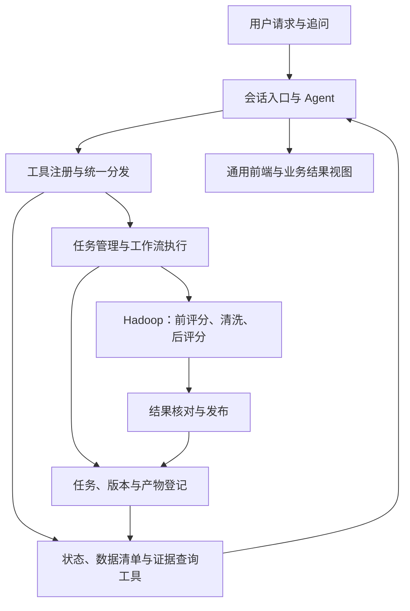

# 迭代一：需求拆解与验收清单

本文将课程要求与小组补充目标转化为开发与验收依据。迭代一同时交付数据治理能力和供三轮迭代复用的 Agent 应用框架。当前已完成 Python 环境、只读数据核查、原始数据版本登记和查询工具；完整系统及正式 Hadoop 评价仍待实现。

- 主负责人：duscwalk；小组其他成员参与方案讨论与交接。
- 交付节点：2026 年 9 月 30 日，提交本轮源码、相关文档并完成汇报。
- 本地环境：使用 `duscwalk` 用户的 Conda 环境 `AgentDev`，当前已验证 Python 3.11.16；新增依赖同步登记，实际复现方法见 [环境指南](../../development/environment.md)。
- 需求来源：[迭代一说明](../../course/迭代一_Hadoop数据清洗与Agent基础.md)、[项目总体要求](../../course/引言_项目总体要求与汇报安排.md)。
- 小组补充目标：第一轮搭建整体 Agent 架构，后续通过扩展工具与工作流接入机器学习和图分析；见 [Agent 整体架构与迭代边界](../../architecture/Agent整体架构与迭代边界.md)。
- 本文标为“课程要求”的内容来自课程文档；“小组补充交付”落实上述架构目标；具体“实现建议”“验收建议”和“待确定事项”可随证据调整。

进一步实现约定见 [技术方案与接口约定](技术方案与接口约定.md)、[数据与评分约定](数据与评分约定.md)及[开发与交接计划](开发与交接计划.md)。首版选型与公式均明确标为建议，实际状态由开发计划维护。

## 1. 本轮交付目标

**本轮同时建设可复用的 Agent 应用框架，并以真实的数据治理工作流验证它。**

**用户在前端输入一次自然语言请求，Agent 自动调用 Hadoop，完成原始数据评分、数据清洗、清洗后评分和结果对比，展示真实结果、处置依据与评价局限，并支持围绕本次任务继续提问。**

框架交付至少包含工具注册与参数校验、工作流与任务状态、会话与证据上下文、版本化产物登记、通用前端入口及工具扩展说明。第二、三轮沿用这些机制，新增独立算法工具、业务工作流和必要的结果视图。

环境和数据源可以预先配置。正常使用过程中，无需用户手动执行 Hadoop 命令、搬运中间文件、逐阶段点击按钮或计算指标。

一次成功任务至少交付：

1. 清洗后的 `ratings`、`movies`、`users` 数据，以及前端可查看的样例。
2. 清洗前后 Accurate、Complete、Unique、Up-to-date、Consistent 五维评分及变化。
3. 数据量变化、异常记录的处理方式、代表性记录和处理原因。
4. 任务标识、原始与清洗后数据版本、清洗规则版本、时间边界 `T1/T2`。
5. 可获取的评估报告，说明评价方法、真实结果、未解决问题和适用局限。

任务失败、尚未完成或证据不足时，返回对应状态与原因；不得生成占位分数或假定成功。

## 2. 范围与边界

| 类别 | 内容 |
| --- | --- |
| 本轮课程要求 | 三表数据检查与清洗、Hadoop 实际执行、清洗前后五维评分、Agent 自动组织任务、简易前端、状态与异常展示、结果追问、报告、版本和时间边界 |
| 小组补充目标（本轮交付） | 可运行的整体 Agent 架构、通用工具与任务协议、产物登记、会话与证据查询、真实工具扩展验收、后续接入说明 |
| 小组自主确定 | 具体清洗规则、评分指标与范围、权重及综合分、Hadoop 部署方式、语言与框架、工具接口、任务组织、页面布局 |
| 后续实验内容 | 分类、聚类、降维、知识图谱、推荐、图挖掘与链接分析；本轮提供可复用的框架、数据、版本及接入约定 |
| 可选汇报材料 | PPT、演示视频及其他辅助材料；源码和相关文档必须提交 |

来自 hw2/hw3 的扩展架构设想不自动增加实验实现要求。当前仍需依据访问需求和实验约束判断是否引入集群高可用、HBase、Hive 等能力。

**实现建议：** 从开发初期明确工具、任务、产物和会话协议，采用模块化应用组织 Agent、查询工具、工作流与处理适配器；先用真实数据清单查询打通通用调用流程，再接入 Hadoop 长任务。

## 3. 需求与验收证据

下列 R 编号用于本轮需求追踪，与作业的问题 P、决策 D、选型 T 编号分别维护。具体的验证操作属于小组验收建议。

| 编号 | 课程要求 | 验收时应提供的证据 | 来源 |
| --- | --- | --- | --- |
| R01 | 一次自然语言请求自动完成全过程；未指定配置时使用已登记默认方案 | 从前端发起任务后，自动完成前评分、清洗、后评分和展示，能查到实际采用的配置 | 迭代一 §1、§4、§5 |
| R02 | 清洗及清洗前后评分均通过 Hadoop 实际执行 | 对应作业的标识、执行记录、状态和输出；可由输出核对报告结果 | 迭代一 §3、§4 |
| R03 | 根据实际数据问题设计清洗规则 | 三表检查统计、规则依据、代表性原始记录与处置结果；区别错误、信息不足与正常现象 | 迭代一 §2 |
| R04 | 用同一套口径比较清洗前后的五维质量 | 五个维度的定义、公式、分母、适用范围及前后结果；无法评价或验证的部分明确标注 | 迭代一 §3、§6 |
| R05 | 说明数据量变化和处置方式 | 分表展示输入输出数量、修复、去重、隔离情况及原因；不把删除或隔离直接解释为修复 | 迭代一 §3、§5、§6 |
| R06 | 展示任务状态、进展与失败原因 | 前端能显示执行中、完成、失败；失败说明包含实际出错阶段及原因 | 迭代一 §4—§6 |
| R07 | 解释结果并支持围绕本次任务追问 | 对分数变化、异常样例和清洗依据的回答能回溯到本次任务的真实数据或报告 | 迭代一 §5、§6 |
| R08 | 提供清洗后样例与可获取的报告 | 前端能查看样例，获取含评分方法、结果、处置和局限的评估报告 | 迭代一 §1、§6 |
| R09 | 保留任务、数据和规则版本 | 从任务或报告能确定采用的原始数据、清洗规则、输出数据，区分不同运行结果 | 迭代一 §1、§4；总体 §1 |
| R10 | 确定并交付供后续轮次复用的 `T1/T2` | 报告与数据登记信息给出一致的时间边界；说明训练、验证、测试的划分方法 | 迭代一 §1；总体 §1 |
| R11 | 无结果时如实说明，保留未解决问题与评价局限 | 执行失败或无可用结果时不出现成功分数；报告说明未验证的真实性等限制 | 迭代一 §3—§6；总体 §1 |
| R12 | 提交可说明、可运行的源码和相关文档 | 环境与启动步骤、工具接口、配置和版本说明、真实实验结果及已知限制；展示版本与提交一致 | 总体 §4、§5 |

### 小组补充交付：可复用的 Agent 架构

以下要求落实负责人的架构目标，具体接口设计见整体架构草案。

| 编号 | 本轮补充交付 | 验收证据 |
| --- | --- | --- |
| R13 | 工具注册与统一调用协议 | 计算工具和查询工具均通过注册信息和参数校验调用；能够新增工具，无需给分发器增加清洗专用分支 |
| R14 | 共用工作流和可查询任务状态 | 工作流定义与执行机制分开；状态、外部作业标识及错误持久化；断开页面连接和应用重启后的行为明确 |
| R15 | 共用产物与版本登记 | 数据、指标和报告使用同一产物引用规则，可追踪来源和生成任务；后续模型、图谱类型有接入位置 |
| R16 | 会话上下文、证据查询和通用结果入口 | 多个任务的追问不会串用证据；前端复用会话、任务、错误和产物入口，业务视图按类型扩展 |
| R17 | 模型与执行适配边界 | 模型配置、工具分发与 Hadoop 业务逻辑分开；工具能力与参数来自登记信息，任务事实来自真实记录 |
| R18 | 扩展与交接验证 | 通过注册接入读取真实数据清单的工具；提供接口说明和实际调用记录，下一轮负责人能够跑通并解释扩展路径 |

## 4. 整体架构与首个工作流

完整模块图、接口草案、任务与产物协议、三轮接入边界见 [Agent 整体架构与迭代边界](../../architecture/Agent整体架构与迭代边界.md)。下图突出本轮的实际调用路径。

- **Agent：** 理解目标、使用注册工具、读取关联任务证据、解释结果与回答追问。
- **工具层：** 校验结构化输入和前置条件，分发查询或计算任务；后续每种算法可作为独立工具接入。
- **任务与工作流：** 固定输入和配置版本，按依赖组织阶段，管理执行状态与错误；治理流程的阶段实现通过此层接入。
- **处理适配器：** 本轮由 Hadoop 实际检查、清洗和评分；后续按需要接入训练与图处理执行方式。
- **产物与查询：** 统一登记数据、质量结果、处置记录和报告，按引用读取真实证据。
- **前端：** 共用会话、任务状态、错误和产物获取入口；首轮实现五维评分等业务视图。

任务状态与当前阶段分开保存，长任务受理后返回任务标识。正常状态为 `queued/running/succeeded/failed`，中断后无法确认实际执行情况时标为 `unknown`，核实后再迁移。只有必需产物核对完成并发布后才标记成功；部分结果不作为完整结果复用。

## 5. 评分与清洗：先确定含义，再确定公式

课程没有指定公式或阈值。下表保留设计时需要回答的问题；候选公式、分母、聚合与输出字段详见数据与评分约定，尚未冻结为可执行默认规则。

| 维度 | 初步检查方向 | 必须说明的边界 |
| --- | --- | --- |
| Accurate | 在有依据时核对值域、编码和可验证事实，明确可计算指标只是哪些准确性方面的代理 | 合法评分、正确格式不证明真实；人口属性无外部证据时无法核验，不得据此宣称“真实性 100%” |
| Complete | 必填字段、应有字段数量、文件与可明确识别的关联信息是否缺失 | 定义业务必需项；未发生的用户—电影评分不视为缺失；官方数据量不作为当前副本的强制目标 |
| Unique | 明确实体键和评分事件键后，检查重复与冲突 | 用户/电影标识冲突与完全重复分别处理；不同时间评分不能仅按用户—电影对直接删除 |
| Up-to-date | 针对使用场景选定参照时间和新鲜度窗口，统计事件年龄或满足时效条件的比例 | 时间戳合法性与新鲜程度分别解释；历史数据较旧本身不等于数据错误；不得只凭时间合法就评为时效性满分 |
| Consistent | 字段类型、格式、类别含义、同键记录及跨表引用一致性 | 解释与准确性指标的交叉；主表冲突、隔离或去重后须重新检查关联关系 |

评分方案确定时，每项指标应记录：公式、分子与分母、检查对象、零分母处理、未解析记录如何计入、无法验证的情况、分表结果及聚合方式。清洗前后保持公式、权重、时间参照和排除规则一致，同时展示实际分母及排除数量的变化。

**实现建议：** 首版可统一采用 0–100 分并暂不设置综合分，但须先验证各维度指标是否有足够依据。正常成功任务应有完整的五维评价；确实无法计算的部分应标明原因，不能用假分数填充，也不能用五项全部“未评价”代替评分功能。

清洗规则的首轮核查重点：

- 按 ISO-8859-1、无表头、`::` 分隔读取；检查空行、字段数、空白和类型，避免默默跳过解析失败的记录。
- 核对评分值域、性别/年龄段/职业编码、类型枚举和时间戳；邮编以字符串保存，不盲目补零或推断真实属性。
- 分开处理完全重复、同键冲突和不同时间的评分事件；标题相同不作为电影去重的充分依据。
- 核查评分与用户、电影的关联；追踪主表处置后对评分记录的连带影响。
- 明确哪些情况可确定性修复、哪些去重、哪些隔离、哪些保留并说明不确定性。

**当前核查证据：** [原始数据核查报告](reports/2026-09-24-原始数据核查.md)已记录当前副本的指纹、结构、值域、重复、冲突和时间分布。清洗应针对这些证据制定规则，不能把“清洗到官方条数”作为目标。

## 6. 数据产物与后续交接

课程要求交付版本、任务标识、清洗数据、报告及时间边界；小组同时交付可复用的 Agent 框架。下表给出产物所需信息；首版具体建议为 UTF-8 JSONL 三表、JSON 指标和清单、Markdown 报告，以及 SQLite 元数据登记，仍待实现验证。框架另需交接工具/任务/产物协议、模型与执行配置方法、会话证据查询方式，以及新增工具的实际示例。

| 产物 | 建议记录内容 | 用途 |
| --- | --- | --- |
| 输入登记 | 文件清单、来源说明、内容校验值、行数、编码、数据版本 | 固定本次处理的输入，发现小组成员使用不同副本 |
| 任务记录 | 任务标识、原始请求、输入版本、规则及评分配置版本、实际参数、阶段、状态、作业标识、错误信息 | 追踪运行过程，支持状态展示和失败诊断 |
| 清洗数据 | 三表输出位置、模式与编码、行数、数据版本、生成任务 | 为迭代二及迭代三提供可读、可关联的数据 |
| 处置记录 | 来源定位、原记录、处置类别、原因、必要时的修复后值 | 核对异常样例和数据量变化 |
| 质量结果 | 各维度前后得分、基础统计、分母、公式或配置版本、未验证项 | 让报告与 Agent 回答有证据可查 |
| 时间边界 | `T1/T2` 的值、时区、确定方法、适用数据版本、边界归属 | 后续轮次使用同一份时间划分 |
| 评估报告 | 结果对比、处置说明、样例、方法、局限和上述版本关联 | 用户获取结果，支撑汇报与交接 |

`T1/T2` 的具体数值与选取方法待核查时间分布后确定，不预设随机划分或固定比例。建议统一使用 UTC，并明确采用训练期 `t <= T1`、验证期 `T1 < t <= T2`、测试期 `t > T2`，要求 `T1 < T2`；最终选择随数据版本登记。

为遵守总体需求中的防泄漏约束，方案中需区分固定业务规则与从数据学习的参数：需要学习的填补值、统计画像或阈值不得从验证/测试信息反向构造训练输入。同一用户跨时间段出现属于时间划分可能产生的正常情况，不应在本轮擅自改为随机用户划分。

建议各表分别核对 `输入行数 = 输出行数 + 去重移除行数 + 隔离行数`，前提是本轮规则不进行记录拆分、合并或新增；如有这些操作，应扩展等式并记录对应关系。修复后保留的记录属于输出的一部分，问题标签可重叠，不能将各类问题计数直接相加当作删除量。

## 7. 验收场景

以下场景验证课程要求及选定实现的正确性；人工构造的小样例仅用于验证规则与失败分支，不作为正式实验结果。

| 场景 | 验收检查 | 对应需求 |
| --- | --- | --- |
| 默认请求正常完成 | 实际数据经 Hadoop 完成三个计算阶段，前端显示五维前后结果、处置与报告 | R01—R05、R08 |
| 结果追问 | 询问“唯一性为什么变化”“隔离了哪些记录”“哪些问题仍无法核验”，回答与本次任务证据一致 | R07、R11 |
| 缺失输入或执行失败 | 明确失败阶段与原因，不返回成功状态或虚构分数；已存在的完整任务结果不被混用 | R06、R09、R11 |
| 重复、冲突、孤立引用等已知样例 | 清洗行为符合登记规则；保留原因；前后统计可核对 | R03—R05 |
| 空数据或某指标无可评价对象 | 不发生除零、不返回默认满分，按已确定方案明确标注不可评价情况 | R04、R11 |
| 数据或规则版本变化后再次运行 | 每次结果能对应实际输入与规则，追问与报告不会串到另一任务 | R07、R09 |
| 时间边界检查 | `T1/T2` 一致、划分无重叠；边界时刻归属明确，后续可复用 | R10 |
| 新工具接入 | 注册一个读取真实数据清单的工具，复用分发、调用记录和通用展示；不得用虚构算法结果证明扩展性 | R13、R17、R18 |
| 多任务与会话查询 | 可查询运行中的任务；追问指定任务获取对应证据；重复传输同一请求不重复受理 | R14、R16 |
| 应用重启 | 可读取已完成任务及产物；未完成任务按外部作业信息核对，无法确认时明确说明 | R14、R15 |
| 交接与汇报演练 | 另一位成员按文档启动并跑通流程，理解算法工具接入位置；约 10 分钟展示系统、结果与局限 | R12、R18 |

全量数据的正式结果只有在实际运行后才能进入实验报告。修改规则或评分口径后，应重新生成配套前后结果并保留版本，不能只更新展示数字。

## 8. 开发顺序与建议节点

以下为小组推进建议，按实际进展调整；9 月 30 日交付节点保持不变。具体 W00—W09 工作项、依赖和完成证据见开发与交接计划。

| 节点 | 工作 | 完成标准 |
| --- | --- | --- |
| 9 月 24—25 日 | 公共接口与整体架构、数据和运行环境核查、规则与评分方案初稿 | 明确工具/任务/产物/会话关系；获得数据基线与技术约束 |
| 9 月 25—26 日 | 实现 Agent 公共框架、产物登记和通用页面；接入真实数据清单查询 | 跑通模型接入、工具注册、调用记录、证据查询与通用展示 |
| 9 月 26—28 日 | 通过共用任务机制接入 Hadoop 完整治理工作流、业务视图和时间边界 | 一次请求完成真实前评分、清洗、后评分及报告，支持状态和追问 |
| 9 月 29 日 | 全量与架构扩展验收、失败和重启检查、文档与交接演练 | 结果可复核，框架可扩展，成员可按文档运行并了解后续接入方式 |
| 9 月 30 日 | 提交与汇报 | 源码、文档与展示版本一致，展示实际结果 |

下一步在已完成的核查与查询工具基础上，推进**清洗/评分配置定稿、Hadoop 环境与共用任务机制**。公共框架继续按接口约定扩展，本地探索统计不替代 Hadoop 的正式评分。

## 9. 待确定事项与作业衔接

| 待确定事项 | 需要的依据 | 影响后续工作 |
| --- | --- | --- |
| 公共协议与框架验证 | 已细化的首版接口、三轮接入需求、`AgentDev` 依赖兼容性 | 验证工具注册、任务、产物与会话的模块实现 |
| 清洗与冲突处置规则 | 真实数据核查、字段语义、可验证依据 | 决定保留/修复/去重/隔离行为和关联处理顺序 |
| 候选五维公式的定稿与时间参照 | 数据与评分约定、实际核查、小样例核算 | 登记默认配置并验证 Hadoop 的统计与评分任务 |
| `T1/T2` 选取方法 | 有效时间分布、后续训练需求、防泄漏约束 | 决定跨迭代时间范围 |
| Hadoop 部署与作业实现 | 本机可用环境、演示机器、资源约束 | 决定运行脚本、依赖与作业提交方式 |
| Agent 模型与接入方式 | 可用的模型服务或本地模型、工具调用能力、成本与运行条件 | 决定自然语言交互和追问实现 |
| 任务记录与结果存储验证 | SQLite 与外部文件的首版方案、版本与失败恢复场景 | 验证受理去重、发布事务及重启核查行为 |

开发中同步记录“问题与证据、触发条件、决策及理由、比较过的技术、实际结果、仍有的限制”。这些记录供另外两位成员完成 hw2/hw3：hw2 提炼技术中立的 P/D，hw3 基于 P/D 比较并形成技术选型记录。

课程使用 `T1/T2` 表示时间边界，hw3 又使用 T 编号表示技术选型；记录中写明“时间边界 T1”或“技术选型 T1”，接口字段建议使用 `train_end`、`validation_end` 避免混淆。
